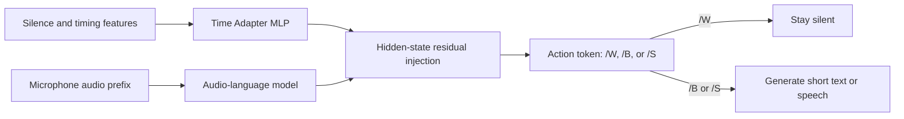

# Time Adapter Research

[](#research-status)
[](#quick-start)
[](LICENSE)

**Timing-aware turn-taking for spoken language models.** This repository explores a small external adapter that tells an audio-language model how long the user has been silent, so the model can decide whether to wait, backchannel, or respond without running full speech generation on every audio tick.

> This is an experimental research release, not a production voice-assistant stack. Reported numbers come from generated or templated evaluation sets and a small number of local recordings; they are not independent benchmarks or production guarantees.

## Core idea

A lightweight Time Adapter converts explicit timing features into a residual vector. The vector is injected into an audio-language-model hidden layer, and a compact action token controls the expensive response path.



The high-frequency loop only scores action tokens. Text and speech generation start when the selected action requires a response.

## Selected results

| Experiment | Main result |
|---|---:|
| Explicit-time recovery from Qwen3-4B hidden states | R² 0.999 |
| Qwen2.5-Omni sequential Time Adapter + proxy head | accuracy 0.990 / macro F1 0.989 |
| Qwen2.5-Omni single-token audio-only DirectLM | accuracy 0.998 / macro F1 0.998 |
| Control-token + short-response LoRA | macro F1 0.997 |
| Pseudo-realtime action-token scoring | p95 309.1 ms; 99.3% under 500 ms |

The important negative result is also included: hidden-state injection alone did not make the base LM head a reliable action classifier. Directly training short control-token logits was substantially more effective. See [the Japanese research summary](docs/PROJECT_SUMMARY_JA.md) for the experiment sequence and limitations.

## What is published

```text
scripts/                 curated dataset, training, ablation, and runtime snapshots
webui/omni_realtime_v1/  browser microphone interface for a compatible checkpoint
docs/EXPERIMENTS.md      experiment map and recommended reading order
docs/PUBLICATION_SCOPE.md publication and provenance boundaries
data/README.md           reproducible data layouts; no dataset rows or audio
requirements.txt         practical top-level dependencies
```

Raw or generated datasets, recordings, checkpoints, base models, caches, private Git history, and text-model-generated semantic training examples are not included. This first public release is deliberately source-only while data and model-artifact provenance is reviewed.

## Quick start

Python 3.12 and an NVIDIA GPU are recommended. The original runs used an RTX 4090. Install a PyTorch build that matches your CUDA driver first, then install the remaining dependencies.

```powershell
git clone https://github.com/onigirikiller/time-adapter-research.git
cd time-adapter-research
python -m venv .venv
.\.venv\Scripts\Activate.ps1
python -m pip install --upgrade pip
# Install the CUDA/CPU PyTorch build appropriate for this machine first.
pip install -r requirements.txt
```

The smallest self-contained experiment downloads its selected Hugging Face model and writes results below `artifacts/time_direction/`:

```powershell
python scripts/run_time_direction_experiment.py --models Qwen/Qwen2.5-0.5B-Instruct
```

Build the deterministic text dataset used by the next experiment family with:

```powershell
python scripts/build_qwen3_phase1_dataset.py
```

The Omni experiments require Qwen2.5-Omni model access, substantially more GPU memory, and generated audio. Follow [docs/EXPERIMENTS.md](docs/EXPERIMENTS.md) rather than running every script in filename order.

## Realtime WebUI

The WebUI is a research runtime for a compatible control-response LoRA and Time Adapter. Checkpoints are not distributed in this source-only release. After reproducing or supplying compatible artifacts, start the local-only server with:

```powershell
python scripts/run_control_response_lora_webui_v1.py --host 127.0.0.1 --port 7865 --autoload --tts-backend none
```

Open `http://127.0.0.1:7865`. Do not expose the server to an untrusted network: it has no authentication and is intended for local experiments.

## Research status

Known limitations include synthetic or templated speech distributions, limited real-microphone testing, VAD errors around quiet speech and breathing, hardware-specific latency, and the need to separate fast action scoring from slower text/TTS generation. Broader safety, bias, multilingual, and robustness evaluation remains open work.

Contributions that improve reproducibility, evaluation coverage, or the separation between the decision path and the generation path are welcome. Please keep claims tied to an explicit dataset split and hardware/runtime configuration.

## License and citation

The repository's original source code and documentation are released under the [MIT License](LICENSE). Model code, base-model weights, generated voices, and third-party packages retain their own licenses and terms. No rights to those external assets are granted here.

Citation metadata is available in [CITATION.cff](CITATION.cff).
